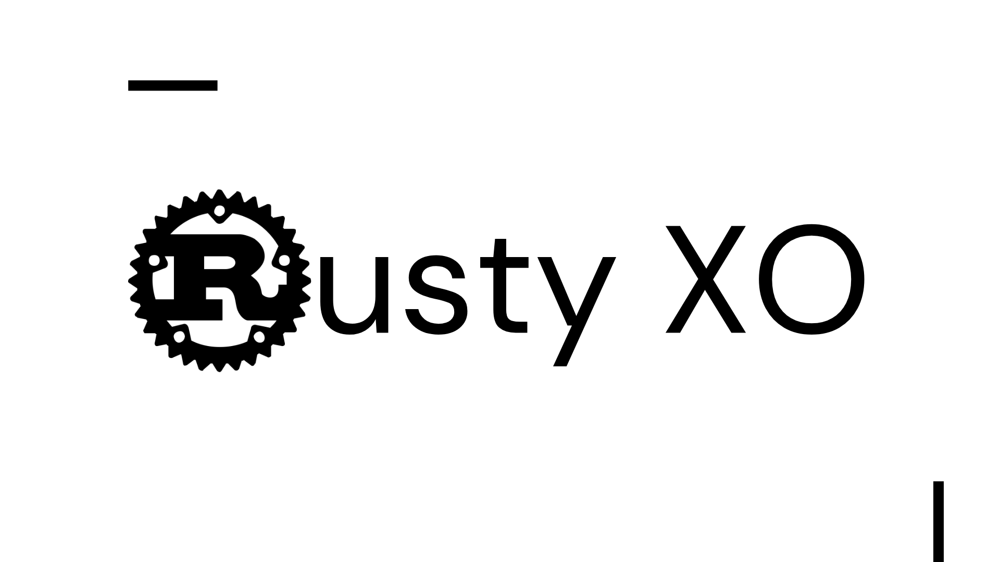

**Rusty XO** is a command-line Tic-Tac-Toe game written in Rust. It features a simple and interactive board, turn-based gameplay, and win detection.

## Features

- **Turn-Based Play**: Alternates between two players using 'X' and 'O'.
- **Win Detection**: Checks for winning conditions or a draw after each move.
- **Exit Option**: Quit the game anytime by entering 'q'.

## How to Run

1. **Clone the Repository**

   ```bash
   git clone https://github.com/dheerajroy/rusty_xo
   cd rusty_xo
   ```

2. **Build and Run**

   Ensure you have Rust installed. Use the following commands:

   ```bash
   cargo build
   cargo run
   ```

## Game Instructions

- **Starting the Game**: Run the application using `cargo run`.
- **Making a Move**: Enter a number between 1 and 9 to place your mark on the corresponding cell.
- **Quitting**: Enter 'q' at any time to quit the game.
- **Winning or Draw**: The game announces the winner or declares a draw when the game ends.

If you enjoyed playing **Rusty XO** or found it useful, please consider giving it a star! 🌟